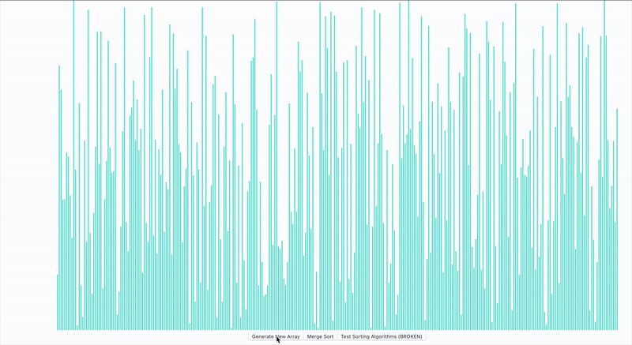

# Sorting Visualizer

A React-based web app that visualizes the Merge Sort algorithm step by step with animations. Built to improve understanding of how sorting works under the hood.

## Features

- Visual representation of Merge Sort
- Animated transitions during sorting
- User-friendly and responsive UI
- More sorting algorithms coming soon!

## Built With

- React
- HTML, CSS 
- JavaScript

## Preview



## Installation

```bash
git clone https://github.com/your-username/sorting-visualizer.git
cd sorting-visualizer
npm install
npm start
